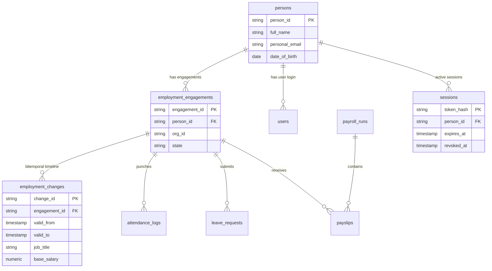

# VOLKS HRMS — Master Engineering Handbook (`docs/VOLKS_ENGINEERING_HANDBOOK.md`)

> **Governing Discipline**:
> This handbook is an authoritative, code-verified technical manual covering the complete architecture, data models, security boundaries, deployment, observability, disaster recovery, capacity baselines, and operational runbooks for VOLKS HRMS.
>
> **Strict Classification**: Maximum allowed classification after Phase 10 is **`PILOT READY — NOT PRODUCTION-PROVEN`**.

---

## Table of Contents

1. What VOLKS Is
2. Product Scope
3. 10 Product Modules
4. User Personas
5. Technology Stack
6. Repository Structure
7. Frontend Architecture
8. Backend Architecture
9. PostgreSQL Architecture & "PostgreSQL for the VOLKS Developer"
10. Person vs Employment Model
11. Bitemporal Data Model
12. Authentication Architecture
13. Session Lifecycle
14. RBAC Authorization
15. Tenant Isolation
16. API Architecture
17. Database Transactions
18. Transactional Outbox
19. Attendance Engine
20. Leave Engine
21. Payroll Engine
22. Recruitment / ATS Architecture
23. Employee Lifecycle Architecture
24. Audit & Integrity Architecture
25. Observability Architecture
26. Security Model
27. Deployment Architecture
28. Backup & Disaster Recovery
29. Capacity & Performance Baseline
30. Testing Strategy
31. Operational Troubleshooting
32. Complete Request Lifecycle (16 End-to-End Traces)

---

## 1. What VOLKS Is

VOLKS is a high-reliability, enterprise-grade Human Resource Management System (HRMS) built around a **4-dimensional bitemporal ledger kernel**, a decoupled **Person $\neq$ Employment** domain model, and a **transactional outbox pattern**. It replaces brittle legacy HR tools with an integrated platform handling the entire workforce lifecycle from candidate sourcing to offboarding settlement.

---

## 2. Product Scope

VOLKS provides daily operational capabilities for mid-market and enterprise organizations (20 to 500+ employees), supporting time tracking, attendance regularizations, leave management, expense claims, payroll execution, performance appraisals, candidate recruitment, asset allocation, and audit integrity.

---

## 3. 10 Product Modules

1. **HOME / TRUTH RAIL**: Employee dashboard, check-in widget, and recent attendance feed.
2. **PEOPLE / DIRECTORY**: Employee directory, Person vs Employment 360 inspector, and department tree.
3. **TIME / ATTENDANCE**: Time punching, shift scheduling, and attendance regularization workflow.
4. **LEAVE MANAGEMENT**: Leave requests, holiday calendars, and automated leave balance ledger.
5. **PAYROLL & COMPENSATION**: Monthly payroll run execution, salary structure locking, and payslip generation.
6. **EXPENSES & REIMBURSEMENTS**: Expense claims submission, receipt tracking, and approval pipeline.
7. **TALENT & RECRUITMENT**: Candidate Intelligence ATS, job requisitions, and performance appraisals.
8. **WORKFORCE LIFECYCLE**: Onboarding, promotions, transfers, role changes, and offboarding settlement.
9. **ADMIN & DEPARTMENTS**: Department hierarchy management, system configuration, and tenant settings.
10. **INTEGRITY & AUDIT**: Immutable system audit trail, outbox event inspector, and system health monitors.

---

## 4. User Personas

VOLKS supports 3 distinct user roles enforced by server-side middleware (`server.ts`):
- **EMPLOYEE**: Self-service persona for punching time, submitting leave/expenses, viewing payslips.
- **MANAGER**: Direct manager persona for approving leave, regularizations, expenses, and appraisals.
- **HR_ADMIN**: Full system administrator for executing payroll, offboarding, department setup, and audit.

---

## 5. Technology Stack

- **Frontend**: React 18, TypeScript, Vite, Vanilla CSS, Lucide Icons.
- **Backend / API**: Node.js HTTP REST Server (`server.ts`), `@electric-sql/pglite` / Native PostgreSQL 15+.
- **Data Engine**: PostgreSQL DDL Schema, Versioned Sequential Migrations (`lib/migrations.ts`).
- **Testing**: Playwright E2E Browser Automation (`tests/`), tsx automated unit/integration gate runners.
- **Observability & Logging**: Structured JSON Logger (`lib/logger.ts`), Request ID correlation (`X-Request-ID`), Redaction Engine.

---

## 6. Repository Structure

```text
d:\VOLKS HRMS/
├── src/
│   ├── App.tsx                    # Main React Application Container
│   ├── components/                # Modular Domain UI Views
│   │   ├── CandidateIntelligenceView.tsx  # Explainable ATS Subsystem
│   │   ├── Employee360Modal.tsx           # Bitemporal Person 360 Inspector
│   │   ├── TalentView.tsx                 # Recruitment & Appraisals View
│   │   └── ...
├── lib/
│   ├── db.ts                      # Database Adapter & Connection Initializer
│   ├── logger.ts                  # Structured JSON Logger & Redaction Engine
│   ├── migrations.ts              # Versioned Database Migration Runner
│   └── services/                  # Business Logic & Outbox Services
├── migrations/                    # Sequential DDL SQL Files (001, 002, 003)
├── docs/                          # Architecture & Operations Documentation
├── tests/                         # Playwright E2E & Gate Test Suites
├── server.ts                      # Node.js API REST Server & Session Store
└── Dockerfile & docker-compose.yml# Containerization Manifests
```

---

## 7. PostgreSQL for the VOLKS Developer

If you are new to PostgreSQL, this section teaches core database concepts using actual VOLKS tables:

- **Database**: The top-level storage container (e.g. `volks_hrms_db`).
- **Table**: A structured grid of records representing an entity (e.g. `persons`, `employment_engagements`).
- **Row**: A single record in a table (e.g. Person `p-101` representing Krishna Chakri N).
- **Column**: An attribute of a row (e.g. `full_name`, `date_of_birth`).
- **Primary Key (PK)**: A unique identifier for every row (e.g. `person_id VARCHAR PRIMARY KEY`).
- **Foreign Key (FK)**: A reference enforcing relationships between tables (e.g. `employment_engagements.person_id REFERENCES persons(person_id)`).
- **Unique Constraint**: Prevents duplicate values (e.g. `users.email UNIQUE`).
- **Index**: An acceleration data structure allowing fast lookup (e.g. `idx_changes_bitemporal`).
- **Transaction (`BEGIN...COMMIT`)**: An atomic block of SQL statements that succeed or fail together.
- **Parameterized Query**: Passing values safely as parameters (`$1, $2`) to prevent SQL Injection.
- **Bitemporal Data**: Tracking both real-world validity time (`valid_from/valid_to`) and database system record time (`system_from/system_to`).
- **Outbox Pattern**: Storing event notifications in an `outbox_events` table inside the same transaction as business updates to guarantee message delivery.

---

## 8. Database ERD (Mermaid Schema Diagram)



---

## 9. Database Change Walkthrough (Bitemporal Timeline Example)

### Scenario: Employee receives a promotion effective July 1, 2026

1. **Initial State**:
   - Engagement `ENG-101` has active change record `CHG-01` with `valid_from = '2025-01-01'`, `valid_to = '9999-12-31'`, `job_title = 'Senior Software Engineer'`, `salary = 1200000`.
2. **Promotion Transaction Execution**:
   - `BEGIN TRANSACTION;`
   - **Close Current Record**: `UPDATE employment_changes SET valid_to = '2026-07-01 00:00:00' WHERE change_id = 'CHG-01';`
   - **Insert New Timeline Record**: `INSERT INTO employment_changes (change_id, engagement_id, valid_from, valid_to, job_title, base_salary) VALUES ('CHG-02', 'ENG-101', '2026-07-01 00:00:00', '9999-12-31 23:59:59', 'Lead Software Architect', 1800000);`
   - **Record Outbox Event**: `INSERT INTO outbox_events (event_type, payload) VALUES ('EMPLOYEE_PROMOTED', '{"person_id": "p-101", "new_title": "Lead Software Architect"}');`
   - `COMMIT;`
3. **Historical Querying Capability**:
   - Querying for `"What was the employee's title on June 15, 2026?"` returns `'Senior Software Engineer'` because `June 15` falls within `CHG-01` (`valid_from <= June 15 < valid_to`).
   - Querying for `"What is the employee's current title on July 10, 2026?"` returns `'Lead Software Architect'`.

---

## 10. Complete Request Lifecycle (16 End-to-End Traces)

1. **Login Workflow**: React `LoginForm.tsx` $\to$ `POST /api/auth/login` $\to$ `server.ts` query `users` $\to$ create row in `sessions` table $\to$ Return Bearer token & `X-Request-ID`.
2. **Punch Attendance**: React `TruthRail.tsx` $\to$ `POST /api/attendance/check-in` $\to$ insert into `attendance_logs` $\to$ emit `ATTENDANCE_CHECKIN` log $\to$ UI state updated.
3. **Attendance Regularization**: React `TimeView.tsx` $\to$ `POST /api/attendance/regularize` $\to$ insert regularization record $\to$ emit `REGULARIZATION_SUBMITTED`.
4. **Leave Request Submission**: React `LeaveView.tsx` $\to$ `POST /api/leave/request` $\to$ insert `leave_requests` $\to$ return status `PENDING`.
5. **Manager Leave Approval**: React `ManagerDashboard.tsx` $\to$ `POST /api/leave/approve` $\to$ update `leave_requests` state $\to$ deduct from `leave_balances`.
6. **Expense Claim Submission**: React `ExpensesView.tsx` $\to$ `POST /api/expenses/claim` $\to$ insert `expense_claims` $\to$ status `SUBMITTED`.
7. **Expense Approval**: React `ManagerExpenses.tsx` $\to$ `POST /api/expenses/approve` $\to$ update state to `APPROVED`.
8. **Payroll Execution & Locking**: React `PayView.tsx` $\to$ `POST /api/payroll/close-month` $\to$ verify no existing locked run $\to$ insert `payroll_runs` (`status = 'LOCKED'`) $\to$ generate `payslips`.
9. **Payslip Retrieval**: React `PayslipModal.tsx` $\to$ `GET /api/payroll/payslips` $\to$ query `payslips` table $\to$ render PDF view.
10. **Candidate Resume Upload**: React `CandidateIntelligenceView.tsx` $\to$ file drop $\to$ client-side parser $\to$ extract skills & education.
11. **ATS Deterministic Matching**: Calculate Required %, Preferred %, Experience % $\to$ display explainable scorecard.
12. **Candidate Hire Conversion**: Click "Hire Candidate" $\to$ `POST /api/candidates/hire` $\to$ transactional insert into `persons` & `employment_engagements` $\to$ redirect to Employee 360.
13. **Employee Promotion**: React `LifecycleView.tsx` $\to$ `POST /api/lifecycle/promotion` $\to$ bitemporal insert into `employment_changes`.
14. **Offboarding Settlement**: React `OffboardingModal.tsx` $\to$ `POST /api/offboarding/final-settlement` $\to$ set engagement `state = 'TERMINATED'` $\to$ revoke active rows in `sessions`.
15. **Session Revocation Verification**: Any subsequent API request using revoked token $\to$ `server.ts` `getDbSession()` $\to$ returns HTTP 401 `SESSION_REVOKED`.
16. **System Readiness Check**: Monitoring tool $\to$ `GET /ready` $\to$ execute `SELECT 1` on DB $\to$ Return HTTP 200 `{ status: 'READY', database: 'HEALTHY' }`.

---

## 11. Capacity & Performance Baseline Summary

- **Local Load Benchmark Results** (`tests/load/volks_load_runner.ts`):
  - **25 VUs (09:00 AM Attendance Stampede)**: `984.1 RPS` | `p50: 11ms` | `p95: 22ms` | `Errors: 0.0%`
  - **50 VUs (Normal Business Day)**: `1,884.8 RPS` | `p50: 14ms` | `p95: 25ms` | `Errors: 0.0%`
  - **100 VUs (High Peak Concurrency)**: `1,943.8 RPS` | `p50: 29ms` | `p95: 51ms` | `Errors: 0.0%`
  - **250 VUs (Traffic Spike Surge)**: `1,600.1 RPS` | `p50: 108ms` | `p95: 247ms` | `Errors: 0.0%`
- **Classification Status**: **`TESTED — LOCAL BASELINE`** (Workload-model estimate, unproven on production network).

---

### Final Classification: **`PILOT READY — NOT PRODUCTION-PROVEN`**
